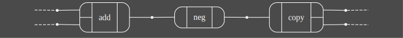
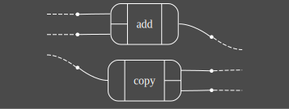
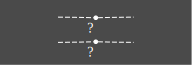
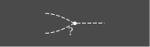
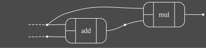

# HExprs: A compact notation for (open) hypergraphs

H-expressions are a notation for *open hypergraphs* inspired by S-expressions.

# HExprs

There are three kinds of expression:

Sequential composition of operations with `(...)` brackets, e.g. `(add neg copy)`:



Parallel composition of operations with `{...}` brackets, e.g. `{add copy}`:



Binding of names to wires with `[...]` brackets. We can write identities (wires
with no operations):

`[x y . x y]`: 

You can also write this as shorthand:

`[x y]`: 

Joining and splitting wires:

`[x x . x]`: 
`[x . x x]`: 

Dispelling and summoning wires:

`[x.]`: 
`[.x]`: 

Lastly, `[x y z]` is shorthand for `[x y z . x y z]`.

Note that name bindings are *global*- they persist *outside* the `[..]` brackets.
This allows you to construct hypergraphs in "imperative style" using square brackets.

    ([a b.] {                    // [a b] are like "function arguments"
        ([.a b] add [acc.])     // acc = a + b
        ([.a acc] mul [result.] // result = a * acc
    })

This expression produces the following diagram:



Each of these diagrams can be generated using `cargo run -- '<expr>' -qv > image.svg`--
(see also `generate_readme_images.sh`).

# Signatures

How do hexprs know that `add` has two inputs and one output? Via a **signature**:
the user must tell the hexpr library the *arity* and *type* of each operation.
For example, `add : ℝ × ℝ → ℝ`.

You can supply operation signature as JSON using the `--signature` or `-s` flag:

```bash
cargo run -- '(add mul neg)' -qv --signature my_signature.json
```

The JSON format specifies inputs and outputs as arrays of type names:

```json
{
  "add": {
    "inputs": ["ℝ", "ℝ"],
    "outputs": ["ℝ"]
  },
  "mul": {
    "inputs": ["ℝ", "ℝ"],
    "outputs": ["ℝ"]
  }
}
```

If no signature file is explicitly provided via `--signature`, an empty signature will be used. With an empty signature, no operations are available - only Frobenius structures (variable binding) can be used. Operations must be explicitly defined in a signature file.

# Category Theory

TODO
