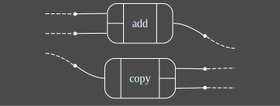
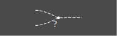
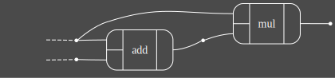

# HExprs: A compact notation for (open) hypergraphs

H-expressions are a notation for *open hypergraphs* inspired by S-expressions.

# HExprs

There are three kinds of expression:

Sequential composition of operations with `(...)` brackets, e.g. `(add neg copy)`:


Parallel composition of operations with `{...}` brackets, e.g. `{add copy}`:



Binding of names to wires with `[...]` brackets. We can write identities (wires
with no operations) as `[x y . x y]`:


You can also write this as shorthand `[x y]`:


Joining `[x x . x]` and splitting `[x . x x]` wires:




Dispelling `[x.]` and summoning `[.x]` wires:


Note that name bindings are *global*- names are still bound to a given wire
*outside* the `[..]` brackets expression.
This allows you to construct hypergraphs in "imperative style" using square brackets.

    ([a b.] {                    // [a b] are like "function arguments"
        ([.a b] add [acc.])      // acc = a + b
        ([.a acc] mul [result.]) // result = a * acc
    } [.result])                 // [.result] says there is one output wire - result.

This expression produces the following diagram:



<!--
Each of these diagrams can be generated using `cargo run -- '<expr>' -qv > image.svg`--
(see also `generate_readme_images.sh`).
-->

# Signatures

How do hexprs know that `add` has two inputs and one output? Via a **signature**.
In order to interpret a hexpr as an open hypergraph, ont must specify a `Signature`.
In Rust, this is the following trait:

```rust
// hexpr::interpret::Signature
pub trait Signature {
    type Arr;
    type Obj;
    type Error;

    fn try_parse_op(&self, op: &Operation) -> Result<Self::Arr, Self::Error>;
    fn profile(&self, op: &Self::Arr) -> (Vec<Option<Self::Obj>>, Vec<Option<Self::Obj>>);
}
```

The `try_parse_op` method parses a hexpr operation to an internal representation,
then `profile` gets the type: the source and target of the operation.

# Category Theory

A HExpr is syntax for defining an "open hypergraph".
Jargonically: open hypergraphs form a category isomorphic to the free symmetric monoidal category on a given signature.

Pragmatically, you can think of open hypergraphs as representing the kinds of
diagram we see above in a precise mathematical sense.
These diagrams have an *algebraic* description in terms of compositions `(f g)`
and tensor products `{f g}`: we'll explore that in detail here.

A *signature* `(Σ₀, Σ₁)` is pair of sets: objects `Σ₀` label wires, and `Σ₁` label boxes (operations).
One intuition is "types" and "primitive functions", but diagrams need not in general represent functions.

Each operation `f ∈ Σ₁` has a *type*: a list of source objects `X₀...Xm` and a list of target objects `Y₀..Yn`.
We write this as `f : X₀...Xm → Y₀...Yn`.

**Mapping hexprs to categories**

Now let `f : A → B` and `g : B → C` be operations. Then:

- The hexpr `(f g)` represents the *composition* of maps `f ; g : A → C`
- The hexpr `{f g}` represents the *composition* of maps `f ; g : A B → B C`
- The hexpr `[x₀ ... x_{n-1}]` represents the identity map on `n` wires

In addition, we have *special frobenius structure*.
This arises naturally as a result of the hypergraph representation, and amounts to adding four extra operations:

- comonoid: `[x . x x]`
- counit: `[x.]`
- monoid: `[x . x x]`
- unit: `[.x]`
